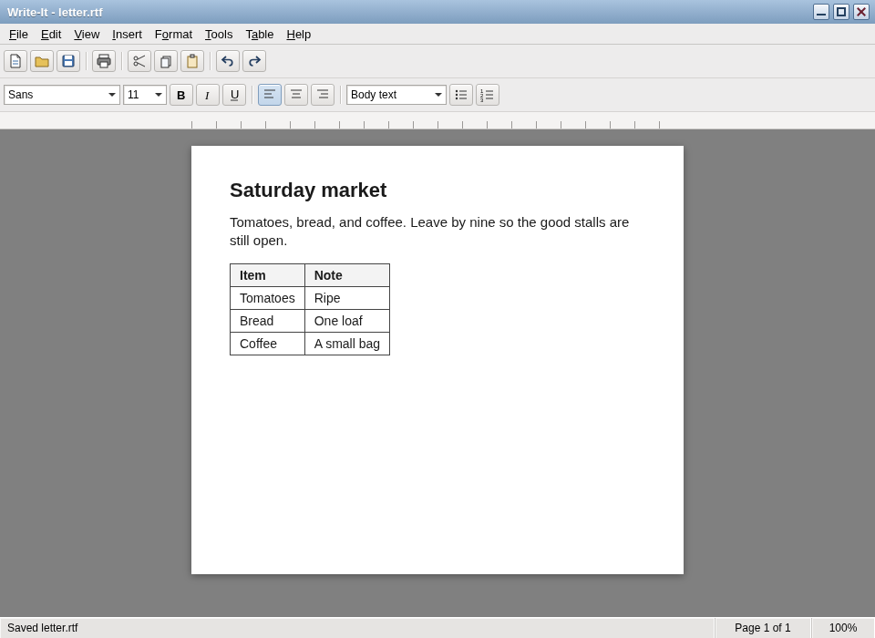

# Write-It

**Vended by Grok Build**

A **Word 97-shaped word processor** for The Lunduke Computer Operating System (LCOS). Write-It is the word processor in Retro-Office, beside Count-It and Show-It.

Binary: `write-it`. Unlicense.

LCOS itself: [https://github.com/BryanLunduke/LCOS](https://github.com/BryanLunduke/LCOS)

## Status

**M1 is done. M2 (Paragraph) is under way.** Typing, character format, undo, find and replace, and RTF open and save are in. Recent files are in. Plain text imports as paragraphs, and Markdown import and export cover headings, paragraphs, bold, and italic. From M2, paragraph indents, left, center, and right alignment, Draft view, and bulleted and numbered lists are in. The packaged release is `v1.0.0` at M5. Where each M2 feature stands, and the specification and M0–M5 milestone plan, are in [DEVELOPMENT.md](DEVELOPMENT.md).

Save writes RTF. Export writes Markdown.

| Doc | What |
|---|---|
| [DEVELOPMENT.md](DEVELOPMENT.md) | Specification, window, RTF, and the M0–M5 milestone plan |

## License

[The Unlicense](https://unlicense.org). See [UNLICENSE](UNLICENSE).
